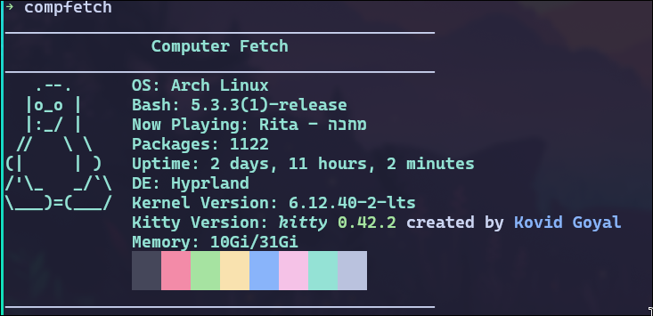

# Computer Fetch
## A very very simple fetch thing I made in C++
I'm learning C++ and thought it would be easy to make something like this...

works on arch maybe on other distros

### Installation for Arch
1. Clone this repo
```bash
git clone https://github.com/arielthemonke/CompFetch.git
```
2. cd into the new dir
```bash
cd CompFetch
```
3. build and install the package
```bash
makepkg -si
```

### Usage
very simple, all you do is run this command anywhere
```bash
compfetch
```
and voila, it should output something like this:


### Legal
this project is licensed under the MIT license.